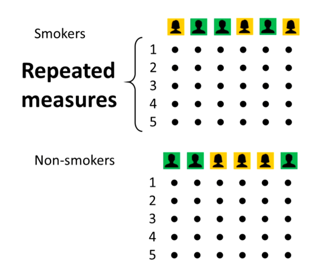
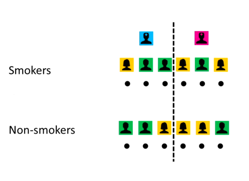

## Introduction

Mixed effects models (also known as hierarchical or multilevel models) are a powerful statistical framework used when data is correlated or grouped in a way that violates the independence assumption of traditional statistical models.  They allow us to account for both fixed effects (the main effects of interest) and random effects (the variability due to grouping factors).  This makes them particularly useful in fields like psychology, education, and medicine where data is often collected from subjects that are grouped in some way 


### Fixed Effects

Statistical tests normally use an underlying model that describes how dependent/response variable changes as a function of one or more independent/predictor variables.  For example, we might want to know how changes as a function of age. We can use a simple linear regression model to describe this relationship:
$$Strength = \beta_0 + \beta_1 \cdot age + \epsilon$$

Where $\beta_0$ is the intercept, $\beta_1$ is the slope (effect of age on strength), and $\epsilon$ is the error term.  Our model here might be:
$$Strength \textasciitilde{} N (\beta_0 + \beta_1 \cdot age, \epsilon^2)$$


This represents our hypothesis about how the world works. Here the values of the independent variable (age) represent the entire population (in which we are interested).  Note, there may be other levels of age, but these are not the focus of our study.  

This model assumes that all subjects are the same and does not account for individual differences i.e. independ and identiacally distributed (the famous iid assumption).

It is important to know that the wrong model reprresents the wrong world view and this will give wrong results.

In general fixed effects are the effects of interest that we want to estimate and make inferences about.  They are called "fixed" because they are assumed to be the same across all levels of the random effects.  For example, in a study of the effect of a drug on blood pressure, the fixed effect would be the effect of the drug, while the random effect could be the variability between subjects.

Lets look at an example of fixed effects using a simulated dataset.  We will simulate data for three hospitals, each with different average symptom severities and different baseline survival rates.  We will then pool the data together and look at the overall relationship between symptom severity and survival proportion, as well as the relationship within each hospital.

```{r}
#| echo: false
#| warning: false
#| message: false
#| results: "asis"

library(tibble)
library(ggplot2)
library(tidyr)
library(dplyr)

set.seed(42)

generate_hospital_data <- function(n_samples = 60) {
  # Hospital configurations: Name, Mean Severity (x), Baseline Survival (y-intercept)
  hospitals <- tibble(
    hospital = c("In 'N Out", "Cypress", "University Medical"),
    mean_sev = c(2.5, 5.0, 7.5),
    base_surv = c(0.55, 0.60, 0.70)
  )
  
  # Generate the dataset
  df <- hospitals %>%
    uncount(n_samples) %>%
    mutate(
      # 1. Generate Symptom Severity clustered around hospital mean
      symptom_severity = rnorm(n(), mean = mean_sev, sd = 0.6),
      
      # 2. Apply a negative within-group slope (-0.15)
      # Survival = Intercept + (Slope * (X - Mean_X)) + Noise
      slope = -0.15,
      noise = rnorm(n(), mean = 0, sd = 0.08),
      survival_proportion = base_surv + (slope * (symptom_severity - mean_sev)) + noise,
      
      # Ensure proportions stay within realistic bounds [0, 1]
      survival_proportion = pmin(pmax(survival_proportion, 0.05), 0.98)
    ) %>%
    select(hospital, symptom_severity, survival_proportion)
  
  return(df)
}
```

```{r}
#| echo: false
#| warning: false
#| message: false
#| results: "asis"

# Generate data
hospital_df <- generate_hospital_data()

hospital_df |> ggplot(
  aes(x = symptom_severity, y = survival_proportion)
  ) +
  geom_point() +
  geom_smooth(method = "lm", se = FALSE, color = "black", linetype = "dashed", linewidth = 1) +
  theme_bw() +
  labs(
    x = "Symptom Severity",
    y = "Survival Proportion"
  )
```

That makes no sense!  We would expect that as symptom severity increases, the survival proportion would decrease.

```{r}
#| echo: false
#| warning: false
#| message: false

hospital_df |> ggplot(
  aes(x = symptom_severity, y = survival_proportion)
  ) +
  geom_point(aes(color = hospital), alpha = 0.7) +
  geom_smooth(aes(color = hospital), method = "lm", se = FALSE) +
  geom_smooth(method = "lm", se = FALSE, color = "black", linetype = "dashed", linewidth = 1) +
  theme_bw() +
  theme(legend.position = c(0.15, 0.25)) +
  labs(
    x = "Symptom Severity",
    y = "Survival Proportion",
    color = "Hospital"
  )
```


It looks like from this chart that univerisity medical only takes patiens with the highest symptom severity, but they have the best survival rates.  In contrast, In 'N Out takes patients with the lowest symptom severity, but they have the worst survival rates.  But within each hospital, there is a negative relationship between symptom severity and survival proportion.  That is, with the lowest symtom severity the higher the survival rate.  That makes more sense, but why is the trend wrong?  (Hint, it isnt its the wrong model to describe the data! )

```{r}
#| echo: false
#| warning: false
#| message: false
#| results: "asis"
#| column: page

# Calculate the average slope and intercept from the 3 hospital linear models
avg_coefs <- hospital_df |>
  group_by(hospital) |>
  summarise(
    intercept = coef(lm(survival_proportion ~ symptom_severity))[1],
    slope = coef(lm(survival_proportion ~ symptom_severity))[2]
  ) |>
  summarise(
    avg_intercept = mean(intercept),
    avg_slope = mean(slope)
  )

hospital_df |> ggplot(
  aes(x = symptom_severity, y = survival_proportion)
  ) +
  geom_point(aes(color = hospital), alpha = 0.7) +
  geom_smooth(aes(color = hospital), method = "lm", se = FALSE) +
  geom_smooth(method = "lm", se = FALSE, color = "black", linetype = "dashed", linewidth = 1) +
  geom_abline(intercept = avg_coefs$avg_intercept, slope = avg_coefs$avg_slope, color = "black", linetype = "solid", linewidth = 1) +
  theme_bw() +
  theme(legend.position = c(0.15, 0.25)) +
  labs(
    x = "Symptom Severity",
    y = "Survival Proportion",
    color = "Hospital"
  )
```

When we average the trend, we get the black solid line.  That is essentially what mixed effect models do - they account for the variability between groups (hospitals) and give us an estimate of the overall trend (fixed effect) while accounting for the random effects of the groups.  The coloured lines are the **Random Effects** and the black line is the **Fixed Effect**.  The fixed effect is the overall trend across all hospitals, while the random effects are the individual trends within each hospital.  The fixed effect is what we are interested in estimating and making inferences about, while the random effects are the variability due to grouping factors that we need to account for.


### Random Effects

These account for variation that you aren't trying to test directly but need to control for. They represent "noise" or "grouping" at different levels, such as variation between individual subjects.  They are sneaky bastards!

Consider the example of studying the effects of smoking on blood pressure.  We design our study and because we are not medical professionals, we get a couple of nurses to measure blood pressure on the groups of smokers and non-smokers every hour:


Here we have **repeated measures**.  Each subject is measured multiple times (every hour).  The measurements are not independent because they come from the same subject and are likely to be correlated - the value this hour is likely similar to the value the previous hour.  Clearlty, this violates the independence assumption.  If we ignore this and use a simple linear regression, we would bias our estimates.  This is the statistically criminal act of **pseudoreplication** (lack of statistical independence within the data).

So suppose we average the measurements for each subject, we now have:



or we could have:  


Could the differences be down to the way different nurses measure blood pressure?  Because this is an effect we aren't interested in, we can treat it as a **random effect**.  This allows us to account for the variability between nurses without having to estimate a separate parameter for each nurse (which would be a fixed effect).  We can use a mixed effects model to account for both the fixed effect of group (smoker vs non-smoker) and the random effect of nurse.

**However!** In the later example it is not possible to distinguish between the effect of group and the nurse because they are confounded.  This is a **fatal** issue with the design of the study.  


## Example

Consider the example where 4 people go on a diet and we measure their weight before the diet, after 1 week, and after 2 weeks.  We want to know if the diet is effective in reducing weight.


```{r}
#| echo: false
library(tibble)
library(ggplot2)
library(tidyr)
library(dplyr)
library(broom)
library(scales)
```

```{r}
#| echo: false
df <- tibble(
    person = rep(1:4),
    before_diet = c(102, 96, 83, 79),
    after_diet_wk1 = c(97, 93, 79, 77),
    after_diet_wk2 = c(95, 87, 78, 75)
)
```

```{r}
#| echo: false
head(df)

df |> 
    tidyr::pivot_longer(cols = -person, names_to = "time", values_to = "weight") |>
    ggplot(
        aes(
            x = factor(time, levels = c("before_diet", "after_diet_wk1", "after_diet_wk2")), 
            y = weight, 
            group = person, 
            color = factor(person)
        )
    ) +
    geom_point() +
    geom_smooth(method='lm', formula= y~x, se = FALSE) +
    theme_bw() +
    labs(
        title = "Weight Loss Over Time",
         x = "Time",
         y = "Weight (kg)",
         color = "Person"
    ) 
```

Everyone is losing weight, so the diet seems to be effective. 

We want to know if the diet has a (statistically significant) effect on weight loss.  We have repeated measures for each person (before diet, after 1 week, after 2 weeks).  We know the measurements are not independent because they come from the same person and are likely to be correlated - the value after 1 week is likely similar to the value before diet.  This violates the independence assumption of traditional statistical models.

Lets nievely try to use a simple linear regression model tonalyse this data using a simple linear regression model that ignores the repeated measures:
```{r}
#| echo: false
#| warning: false

df_long <- df |> 
    tidyr::pivot_longer(cols = -person, names_to = "time", values_to = "weight") |> 
    dplyr::mutate(time_x = case_when(
        time == "before_diet" ~ 0,
        time == "after_diet_wk1" ~ 1,
        time == "after_diet_wk2" ~ 2
    ))

model_lm <- lm(weight ~ time_x, data = df_long)
```

The model shows:
```{r}
#| echo: false
df_long |> 
    ggplot(
        aes(
            x = factor(time, levels = c("before_diet", "after_diet_wk1", "after_diet_wk2")), 
            y = weight, 
            group = person, 
            color = factor(person)
        )
    ) +
    geom_point() +
    geom_smooth(method='lm', formula= y~x, se = FALSE) +
    geom_abline(
        intercept = tidy(model_lm) |> filter(term == "(Intercept)") |> pull(estimate), 
        slope = tidy(model_lm) |> filter(term == "time_x") |> pull(estimate), 
        color = "black", linewidth = 1, linetype = "dashed"
    ) +
    theme_bw() +
    labs(
        title = "Weight Loss Over Time",
         x = "Time",
         y = "Weight (kg)",
         color = "Person"
    ) 
```

With the results:
```{r}
#| echo: false
#| results: "asis"
knitr::kable(tidy(model_lm), digits = 3)
```

```{r}
#| echo: false
#| message: false
p_val1 <- broom::tidy(model_lm) |> 
  dplyr::filter(term == "time_x") |> 
  dplyr::pull(p.value) |> 
  as.numeric() |> 
  scales::pvalue(accuracy = 0.0001)
```

What this gives is `p-value` of `r p_val1` >> 0.05 .  In this case, we would **NOT** reject the null hypothesis $H_0$: slope = 0 and conclude that there is no statistically significant effect of the diet on weigh loss.  So by using the wrong model and not accounting for the groups (repeated measures), we have failed to detect a significant effect that is actually present in the data.  This is a type II error (false negative) and is a direct consequence of violating the independence assumption.

::: {.callout-note}
Definition of a p-value: The p-value is the probability of observing data as extreme as, or more extreme than, the data observed under the null hypothesis.  It is a measure of the evidence against the null hypothesis.  A small p-value (typically less than 0.05) indicates strong evidence against the null hypothesis as the liklihood of observing the data is low, while a large p-value indicates weak evidence against the null hypothesis.
:::

Back in the day we would deal with this using a repeated measures ANOVA, which is a special case of a mixed effects model, which adjusted the `p-value` based on how correlated the data were.  However, the modern approach developed in the 1990s and 2000s is to use a mixed effects model, which allows us to account for the correlation within individuals and provides more accurate estimates of the standard errors, which in turn allows us to correctly detect significant effects.

Now let's use a mixed effects model to account for the repeated measures.  We treat the subject effects as random effects, which allows us to account for the variability between individuals without having to estimate a separate parameter for each individual (which would be a fixed effect).  The model can be specified as follows:

```{r}
#| echo: false
#| warning: false
library(lmerTest)
library(broom.mixed)

model_mem <- lmerTest::lmer(weight ~ time_x + (1 | person), data = df_long)
``` 
**Note** we are using the lmerTest package instead of lme4 because it provides p-values for the fixed effects, which is what we are interested in here.  Douglas Bates, made a deliberate design choice in lme4 **not** to provide p-values for the random effects.

The `(1 | person)` syntax specifies a random intercept for each person, allowing us to account for the variability between individuals.


The model shows:
```{r}
#| echo: false
tidy_results <- broom.mixed::tidy(model_mem, effects = "fixed")
tidy_results
```

```{r}
#| echo: false
#| message: false
p_val2 <- broom::tidy(model_mem) |> 
  dplyr::filter(term == "time_x") |> 
  dplyr::pull(p.value) |> 
  as.numeric() |>
  scales::pvalue(accuracy = 0.0001)
```  

Now, we're getting somewhere!

Our `p-value` for the effect of time is `r p_val2` << 0.05 .  In this case, we would reject the null hypothesis $H_0$: slope = 0 and conclude that there is a statistically significant effect of the diet on weight loss.  By using the correct model and accounting for the groups (repeated measures), we have correctly detected a significant effect that is present in the data.  This is the power of mixed effects models in handling correlated data and avoiding type II errors.

But note, our plots and esimated effects are the same in both models.  The difference is in the statistical inference we can make about the effect of time on weight loss.  The mixed effects model allows us to make valid inferences by accounting for the correlation within individuals, while the simple linear regression model does not.

So why does this happen? The simple linear regression model assumes that all observations are 
independent, which is not the case here due to the repeated measures. To see why, let $y_{ij}$ 
be the weight of person $i$ at time $j$. The simple linear regression model is:

$$
y_{ij} = \beta_0 + \beta_1 x_{ij} + \epsilon_{ij} \tag{1}
$$

where $x_{ij}$ is the predictor and $\epsilon_{ij}$ is the residual error. The problem with 
equation (1) is that the single error term $\epsilon_{ij}$ is doing too much work - it is 
trying to capture both the fact that people start at different weights, and the fact that 
weight changes over time within a person. These are two different sources of variability, 
and we need to separate them.

We can do this by splitting $\epsilon_{ij}$ into two parts: a person-level deviation $b_{0i}$ 
that captures where person $i$ starts relative to the average, and a residual $e_{ij}$ that 
captures the remaining variability within person $i$ over time:

\begin{align*}
y_{ij} &= \beta_0 + \beta_1 x_{ij} + \epsilon_{ij} \\
       &= \beta_0 + \beta_1 x_{ij} + b_{0i} + e_{ij} \tag{2} \\
       &= (\beta_0 + b_{0i}) + \beta_1 x_{ij} + e_{ij} \tag{3}
\end{align*}

Because $b_{0i}$ represents a person's starting point it is constant across all time points 
for that person - it only varies between people, which is why it carries only the 
subscript $i$. We assume these two components are independent of each other and normally 
distributed:

$$
b_{0i} \sim \mathcal{N}(0, \sigma^2_b), \qquad e_{ij} \sim \mathcal{N}(0, \sigma^2_e) \tag{4}
$$

Equation (3) is the random intercepts model. Each person now has their own intercept 
$(\beta_0 + b_{0i})$ - their personal starting point - which is shifted up or down 
from the population average $\beta_0$ by $b_{0i}$. The slope $\beta_1$ remains the same 
for everyone, meaning we are still assuming that the rate of change is the same across 
all people.

Going back to equation (1), we can now see the problem clearly. By using a single error 
term $\epsilon_{ij}$, the simple linear regression model treats all observations as 
independent. But **observations from the same person share the same starting point $b_{0i}$, 
which means they are correlated**. Ignoring this correlation means the model cannot 
distinguish between between-person variability $\sigma^2_b$ and within-person variability 
$\sigma^2_e$ - it lumps them together into $\epsilon_{ij}$. This leads to incorrect 
standard errors and unreliable hypothesis tests.


## Choice of Random Effects Models

In the previous example we used a random intercept model, which allows for different baseline weights for each person but assumes that the effect of time is the same across all individuals, which they clearly dont.  Different people will experience weight loss at different rates for a multitude of factors.  It is possible to use a **random intercept random slope model**.  The model can be specified as follows:

$$
\begin{aligned}
y_{ij} &= \beta_{0i} + \beta_{1i} x_{ij} + e_{ij} \\
\end{aligned}
$$

Here, 

$\beta_{0i} = \beta_{0} + b_{0i}$ is the random intercept for person $i$, which is made up of the overall intercept $\beta_0$ and the individual-specific deviation $b_{0i}$.

$\beta_{1i} = \beta_{1} + u_{1i}$ is the random slope for person $i$, which is made up of the overall slope $\beta_1$ and the individual-specific deviation $u_{1i}$.


```{r}
#| echo: false
model_mem_random_slope <- lmerTest::lmer(weight ~ time_x + (time_x | person), data = df_long)
``` 
```{r}
#| echo: false
tidy_results <- broom.mixed::tidy(model_mem_random_slope, effects = "fixed")
tidy_results
```

This model allows for both random intercepts and random slopes, meaning that each person can have their own baseline weight and their own rate of weight loss over time.  The choice between a random intercept model and a random slope model depends on the research question and the structure of the data.  If we are primarily interested in the average effect of time on weight loss across all individuals, a random intercept model may be sufficient.  However, if we are interested in understanding how rate of weight loss varies between individuals, a random slope model may be more appropriate.  It is important to note that random slope models are more complex and require more data to estimate the additional parameters, so they should be used with caution and only when there is a theoretical justification for their use.
